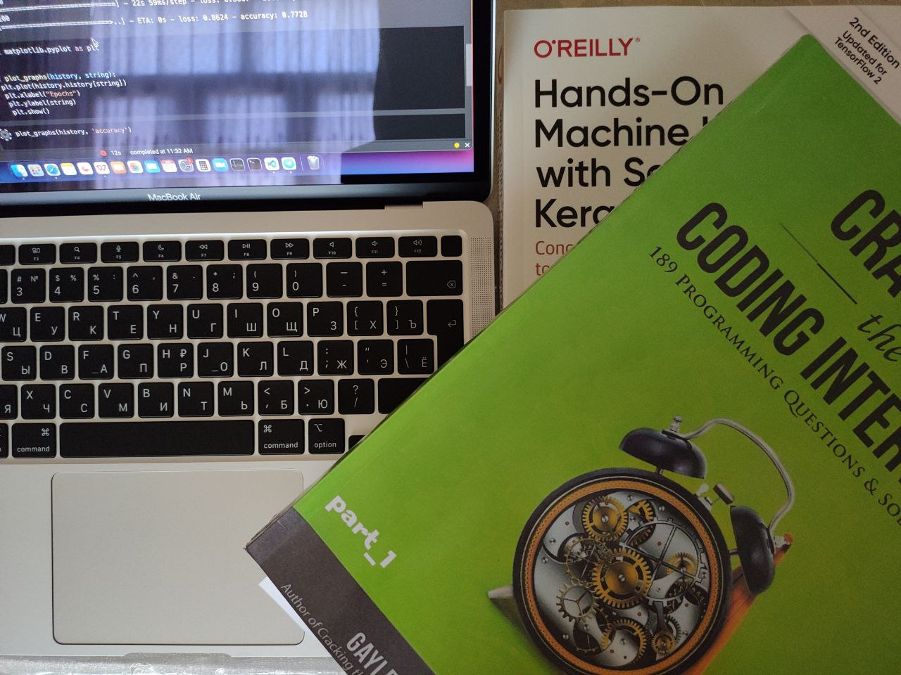

# Cracking the Coding Interview 

Rustam-Z 🚀 • 8 June 2021

This document will guide you through my steps for preparing for my Google interviews. Overall, it took me 2 years to crack the MAANG interview, including learning algorithms and data structures, practicing coding & problem-solving, and applying and passing all interviews.

> Join my Telegram channel: [@cracking_maang](https://t.me/cracking_maang), where I share MAANG interview preparation resources.

## General plan
1. Learning algorithms and data structures. 
2. Solving algorithms, and learning patterns and concepts. 
3. Practicing coding & problem-solving questions together with friends on the whiteboard.
4. Learning System Design. 
5. Writing a resume. Applying to jobs.
6. Preparing for a behavioral interview.
7. Getting an interview invitation, passing all interviews, and getting an offer! 🍾

## How did I learn data structures and algorithms? Here are the resources I used:
1. I had a Data Structures class at university. [Here are the notes I have from the class.](https://github.com/Rustam-Z/data-structures-and-algorithms) 
2. [Naso Academy DS playlist](https://www.youtube.com/playlist?list=PLBlnK6fEyqRj9lld8sWIUNwlKfdUoPd1Y)
3. [The Last Algorithms Course You'll Need](https://frontendmasters.com/courses/algorithms/introduction/)
4. [Jenny's DSA playlist](https://www.youtube.com/playlist?list=PLdo5W4Nhv31bbKJzrsKfMpo_grxuLl8LU)
5. [programiz.com/dsa](https://www.programiz.com/dsa)
6. [Data Structures by Google Software Engineer](https://www.youtube.com/playlist?list=PLDV1Zeh2NRsB6SWUrDFW2RmDotAfPbeHu)
7. NeetCode videos: here’s [one of them](https://youtu.be/uhYq27iSk9s?feature=shared)
8. AlgoExpert Data Structures course 

## Practicing coding & problem solving questions:
1. [interviewbit.com](https://www.interviewbit.com/courses/programming/)
2. [LeetCode Explore](https://leetcode.com/explore/) (only data structures cards)
3. [LeetCode study plan](https://leetcode.com/study-plan/) — [Data Structure 1, Algorithm 1, Programming Skills 1](https://gist.github.com/priyavrat-misra/a776a005ee4a68edda535f4a7e1b6adb). 
4. "Cracking the coding interview" + [CTCI problems in LeetCode](https://leetcode.com/discuss/general-discussion/1152824/cracking-the-coding-interview-6th-edition-in-leetcode)
5. [LeetCode study plan](https://leetcode.com/study-plan/) — [Data Structure 2, Algorithm 2, Programming Skills 2.](https://gist.github.com/priyavrat-misra/a776a005ee4a68edda535f4a7e1b6adb)
6. AlgoExpert video solutions
7. [neetcode.io](https://neetcode.io/) & [NeetCode playlist](https://www.youtube.com/c/NeetCode/playlists)
8. LeetCode company tagged questions

## System Design Learning Plan
- [ ] "Systems Expert" from AlgoExpert
- [ ] "System Design Interview" book - 1st and 2nd editions
- [ ] "Grokking the System Design Interview" (educative.io)
- [ ] "Designing Data-Intensive Applications" book
- [ ] [Tushar](https://www.youtube.com/user/tusharroy2525/playlists)

## Problem-solving approach

**Constraints, Ideas, Complexities, Code, and Tests**

1. Read the problem. Don’t immediately jump into coding!
2. Understand inputs & outputs. Draw some examples on paper.
3. Ask questions, and find constraints (edge cases). Find edge cases. Example questions: is it ASCII or Unicode? what is the Max value? is there a difference between capital letters and small letters?
4. Thinking about the solution in mind. Divide problems into sub-problems. Ideas (whys, tradeoffs, solve simpler version, imagine helper functions - go from high level to low level).
5. Evaluate the complexity.
6. Think of a better alternative solution.
7. Write code on paper.
8. Debug your code on paper and test with new corner case inputs.
9. Write code and write tests.
10. More to read:
    - https://www.hiredintech.com/algorithms/algorithm-design-canvas/what-is-the-canvas/
    - https://www.notion.so/Cracking-Google-Interview-Part-2-Interview-preparation-roadmap-Algo-DS-System-Design-Testin-0db63db83370414bac62343edf95034e?pvs=4

## Topics
- Big-O = **how quickly the runtime grows relative to the input as the input gets arbitrarily large.**
- Strings
    - ASCII, Unicode
    - How are strings implemented in your programming language (for example, is there a maximum length)?
    - Search for substrings (for example, the Rabin-Karp algorithm).
    - RegEx
- Arrays
    - Details of implementation in your programming language. For example, for C++ you need to know the implementation using pointers, and vectors. For vectors, you also need to know, for example, that it periodically does resize, and other similar details.
- Linked lists
    - Singly linked list
    - Doubly linked list
- Stacks and Queues
- Trees
    - DFS, BFS
    - Adding and removing elements
    - Less common tree types (e.g., red black trees, B-trees) - what are they, how they
    differ from the binary trees, basic complexities, and how they are used. No need to know all the rotations in the RB-tree, for example.
    - Tries
- Heaps
    - Heap sort
    - Using heaps for tracking top-K
    - Allocating elements on a heap vs on a stack - what does it mean?
- Graphs
    - DFS, BFS
    - Topological search
    - Shortest path
- Hash
    - Hash functions
    - Universal hash
- Algorithms
    - Sorting
        - Especially make sure you know heap sort, merge sort and quick sort.
    - Searching
        - Binary search
        - Searching in linked lists, arrays, trees, graphs, dictionaries...
    - Dynamic programming = problems, which are problems where the solution is composed of solutions to the same problem with smaller inputs.
        - Bottom-up
        - Top-down
    - Backtracking = Backtracking is an algorithmic technique for solving problems recursively by trying to build a solution incrementally, one piece at a time.
    - Greedy algorithms
    - Recursion

## Questions (corner cases and constraints)
1. Ask about edge cases (propose edge case). Explain and clarify, DS tradeoff, time, and space complexity.
2. Questions
    1. How am I receiving this data?
    2. How should I output the result?
    3. What if the wrong input is provided?
    4. How long/big our input could be?
3. Is size, speed, and using a build-in library a concern?
4. How I would be testing?
   - Tests: Zero, one, two, two to max-1, max, max+1
   - **Empty inputs, null values, 0 length, 1 element input, super long input.**   
6. Questions to ask
    - OOP
        1. how many calls will we get for each?
        2. Do we need caching if similar calls or similar work needs to be done?
        3. what if the data object is empty before calling the remove/pop/top methods?
    - Number (int, float)
        1. what if we have floats?
        2. Zero? 
        3. Can we have negative/positive numbers? 
        4. what is the range of an integer? max and min integer?
        5. dividing by zero?
        6. do we have leading 0s?
        7. Can we use bit manipulation? XOR?
    - Strings
        1. ASCII, Unicode UTF-8 (special chars)? Character encoding standards. `ProTip™, 👻, 60%, https://google.com`
        2. Only lower-case English characters, or? How to handle them?
        3. what if the string is empty, “ “, NULL, length is 1?
        4. spaces in string in the beginning or in the end?
        5. Max and min length of string?
        6. sorted? can we sort it out?
        7. DS: Can we use stack, queue, or heap? If duplicates maybe use stack?
    - Array
        1. Mutable or immutable array?
        2. Should it be in place? Or do we need to return a new one?
        3. Items in the array are all unique?
        4. Do we have repeated items in the array? OR can I use the same element twice?
        5. Does the array contain NULLs?
        6. How to handle an empty array?
        7. What would I do if the array is super large?
        8. Can we sort the array?
        9. Do we need to preserve ORDER?
    - Sorting algorithm
        1. empty input, null input
        2. 1 element, very long input
        3. duplicate elements (sort on a second condition?)
        4. odd/even length input
        5. Collection with all elements equal?
        6. Garbage inside the collection?
    - Stack/queue
        1. removing elements from empty stack/queue
    - Linked list
        1. Single linked list or doubly linked list?
        2. Is it a circular linked list?
        3. How many nodes does the linked list contain?
        4. Null values for head/root 
        5. Can it be empty?
        6. Values are sorted? Are there any duplicate numbers?
        7. Can I convert it to an array?
    - Tree
        1. Is it a Binary Tree? (Each node has at most two children.)
        2. Is it a Binary Search Tree (BST)? (The left child is less than the parent, and the right child is greater.)
        3. If BST do we have duplicates? And on which side?
        4. Height of the tree? (Longest path from a leaf node to root.)
        5. Depth of a specific node? (Length of the path from the root to that node.)
        6. Is it a Balanced Tree? (Height of left and right subtrees differ by at most 1. Ensuring `O(logn)` for insert and find)
        7. Is it a Complete Binary Tree? (All levels are filled, except possibly the last one, and nodes are left-justified.)
        8. Is it a Full Binary Tree? (Each node has either 0 or 2 children.)
        9. Is it a Perfect Binary Tree? (All internal nodes have two children, and all leaves are at the same level.)
        10. Is it a Binary Heap? (Specifically for Binary Trees that follow the heap property.)
        11. Is it a Symmetric Tree (or Mirror Tree)? (The left subtree of one node is a mirror image of the right subtree of the other node.)
    - Graph
        1. Directed (one-way street) or undirected (two-way)?
        2. Connected graph (an undirected graph, there is always a path to the node) or not connected?
        3. Strongly connected graph (directed graph, when there is always a route)
        4. Cyclic or Acyclic? (Does the graph contain any cycles, or is it a directed acyclic graph (DAG)?)
        5. Weighted or Unweighted? (Are there numerical values assigned to the edges?)
        6. Tree or Forest? (Is the graph a connected acyclic graph or a collection of disconnected trees?)
        7. Complete or Incomplete? (Does every pair of distinct vertices have an edge between them?) From any node (vertex) you can do to any node.
        8. Should I use DFS or BFS?
        9. Dijkstra?
    - Loops
        1. while loops running forever (properly incre./decree. pointers)
    - Recursion
        1. recursion 1.000 call stack size is input too big?
 7. More to read:
    - https://www.hiredintech.com/classrooms/algorithm-design/lesson/78
    - https://www.techinterviewhandbook.org/algorithms/study-cheatsheet/
    - https://medium.com/swlh/taking-the-edge-off-of-edge-cases-7b3008d83a57
   

## Extra Resources
- [Article by Sergey Sema](https://dou.ua/lenta/articles/google-interview/)
- [InterviewPreparationGuide.pdf](http://larrr.com/wp-content/uploads/2016/10/InterviewPreparationGuide.pdf)
- [faang-interview.github.io](https://faang-interview.github.io/)
- [docs.outtalent.com/guides](https://docs.outtalent.com/guides)
- [Coding interview tips](https://www.interviewcake.com/coding-interview-tips)
- [Interview Cake Coding Interview Tips](https://www.interviewcake.com/coding-interview-tips)
- [Prepare for Your Google Interview: Coding](https://youtu.be/6ZZX9iIgFoo?feature=shared)
- [Interview tips from Google Software Engineers](https://youtu.be/XOtrOSatBoY?feature=shared)
- [Coding Mock Interview](https://www.youtube.com/watch?v=XKu_SEDAykw)
- [Tech Interview Process](https://youtu.be/nemEAjYcdo0?feature=shared)
- [Preparing for a Technical Interview](https://youtu.be/OMkfujDPpwc?feature=shared)
- [Prepare for your Google Interview: General Cognitive Ability](https://youtu.be/eIMR82oO2Dc?feature=shared)
- [Prepare for your Google Interview: Leadership](https://youtu.be/2Cr3-et4xkI?feature=shared)

