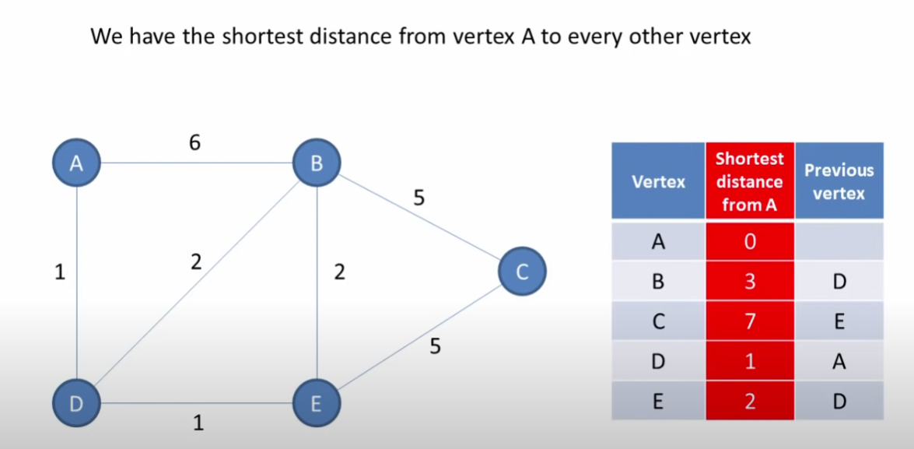

# [Graphs](https://github.com/Rustam-Z/data-structures-and-algorithms#graphs)

## Graph
- Vertices = nodes, edges = lines between vertices, adjacent vertices = there is an edge (link) between them 
- Graph is a collection of nodes with edges between some of them.
- Tree is a graph, but not all graphs are trees. Tree is connected graph without cycles.
- Graph can be represented as adjacency matrix (2D array) or adjacency list (array of linked lists).
- **Directed** = one way street, **undirected graph** = two-way street, do not point to any direction.
- **Connected graph** = undirected graph in which there is always a path from a vertex to any other vertex.
- **Strongly connected graph** = directed graph (one way edges) in which there is a route between every two nodes.
  - Kosaraju's Algorithm is used to find strongly connected components in a graph. Based on DFS that implemented twice.
- [**Spanning tree**](https://www.programiz.com/dsa/spanning-tree-and-minimum-spanning-tree) 
  - A sub-graph of an undirected connected graph, which includes **all** the vertices of the graph with a minimum possible number of edges. If a node/vertex is missed, then it is not a spanning tree.
  - The total number of spanning trees with n vertices that can be created from a complete graph is equal to n(n-2).
  - Example: computer network routing protocol.
- **Minimum spanning tree** = Spanning tree in which the sum of the weight of **all edges** is as minimum as possible.
  - Example: to find paths in the map, to design networks like telecommunication networks, water supply networks, and electrical grid.
- **Shortest path** differs from the minimum spanning tree because the shortest distance between two vertices might not include all the vertices of the graph.

## Graph algorithms
- DFS (depth first search) 
  - DFS is often preferred if we want to visit every node in the graph. Will not find the shortest path.
  - Uses stack, and recursion.
  - Time complexity is O(V+E), V being the number of vertices and E being the number of edges.
  - Space complexity is O(V).
- BFS (breadth first search)
  - Shortest path between two nodes.
  - Uses queue, and iterative.
  - Time complexity is O(V+E), V being the number of vertices and E being the number of edges.
  - Space complexity is O(V).
  - Example: find a path of friendship between A and B. DFS will do deep. But with BFS, we will stay close to nodes neighbors. 
    We will not go to distant connections until absolutely necessary.
- [Dijkstra's algorithm](https://youtu.be/pVfj6mxhdMw) 
  - Dijkstra algorithm is used to find the shortest path from **one node to all other nodes** in a weighted graph.
  - Works in directed and undirected graphs.
  - It differs from the minimum spanning tree because the shortest distance between two vertices might not include all the vertices of the graph.
  - Time complexity is O(E logV), V being the number of vertices.
  - Space complexity is O(V).
  - Notice that to come from A to C, we need to come to E first. So, we already found the shortest path to E, we will use this info.
    <br>
- [A* Pathfinding algorithm](https://youtu.be/eSOJ3ARN5FM) - similar to Dijkstra's algorithm but uses heuristics (manhattan distance) to find the path.
  - A* finds the shortest path from **one node to another node** in a weighted graph.
  - A* does not have to visit all vertices, ideally.
  - It is a combination of Dijkstra’s algorithm and Greedy Best-First-Search. It uses heuristics to find the path. A* picks the most promising looking node next. Dijkstra uses heap to peak the next.
  - The quality of algorithm depends on how well heuristic values are calculated.
    - If all of them are 0, it will be Dijkstra’s algorithm.
    - If they are greater, we may find not the shortest path.
    - If they are lower, it will take more time to calculate path.
  - Time complexity is O(E logV), V being the number of vertices.
  - Space complexity is O(V).
  - Example: Google Maps, finding the shortest path between two points on a map, space exploration.
- **Prim's algorithm** (Minimum spanning tree for undirected + connected)
  - Runs faster for dense graphs. Visits node more than once.
  - Time complexity of O(V2), V being the number of vertices and can be improved up to O(E logV) using Fibonacci heaps
  - Example: travelling salesman problem, network for roads
  - Prim’s algorithm prefer list data structures
- **Kruskal's algorithm** (Minimum spanning tree for undirected + connected & disconnected)
  - Runs faster for sparse graph. Visits node only once.
  - You have more control when same weight occurs.
  - Time complexity is O(E logV), V being the number of vertices
  - Example: LAN connection, TV Network
  - Kruskal’s algorithm prefer heap data structures
- [Kosaraju's algorithm](https://www.programiz.com/dsa/strongly-connected-components) (Strongly connected component) = finding portion of a directed graph in which there is a path from each vertex to another vertex
  - Perform a depth first search on the whole graph
  - Reverse the original graph
  - Perform depth-first search on the reversed graph

## Graph representation
```python
adjacency_list = defaultdict(list)

# Build adjacency list to represent the graph
for src_node, dst_node in edges:
    adjacency_list[src_node].append(dst_node)
    adjacency_list[dst_node].append(src_node)
```

