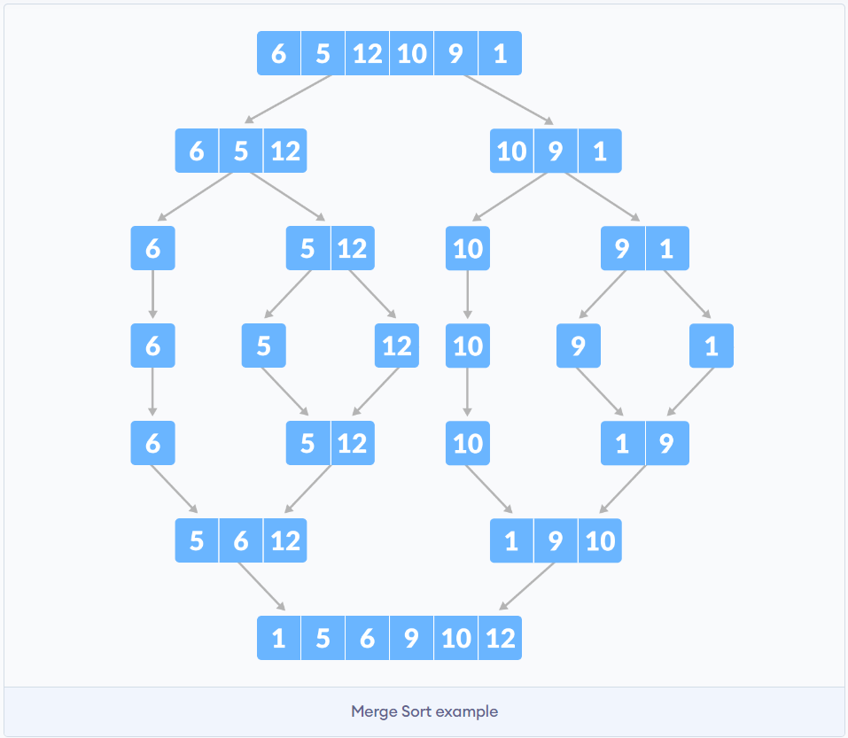
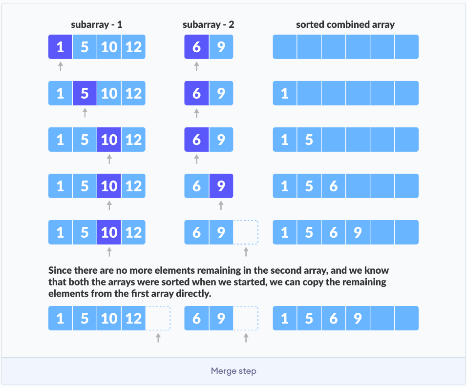
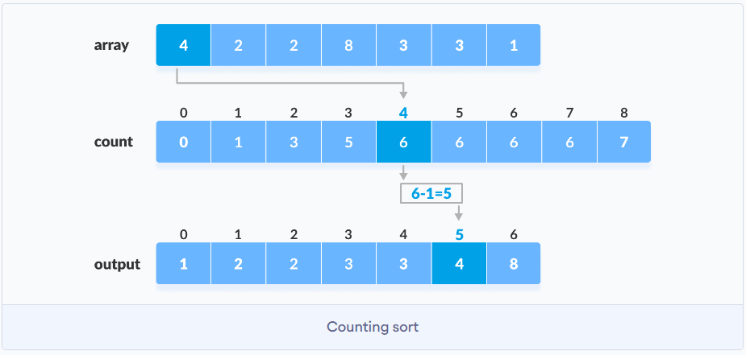
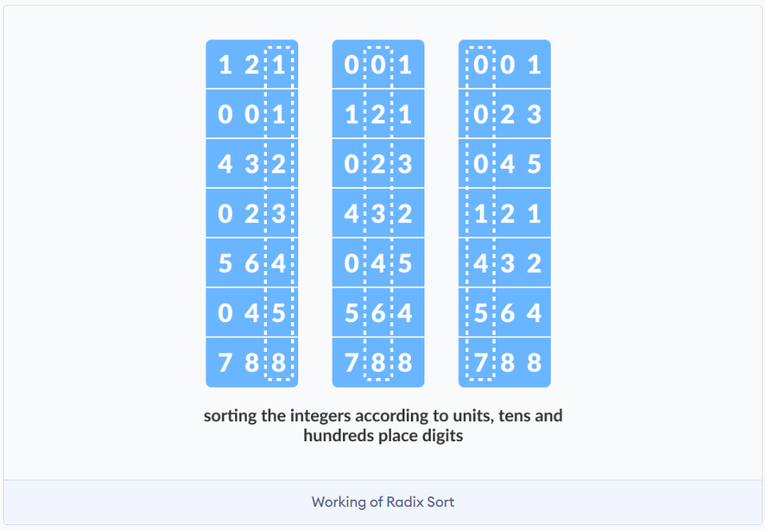
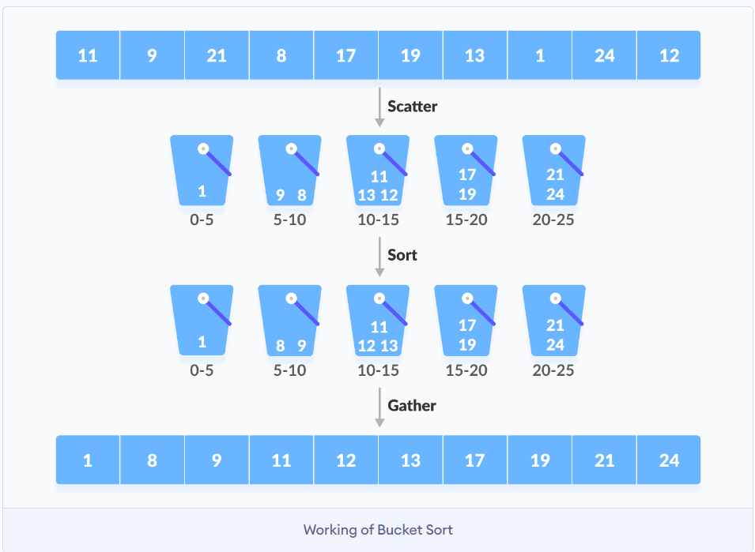
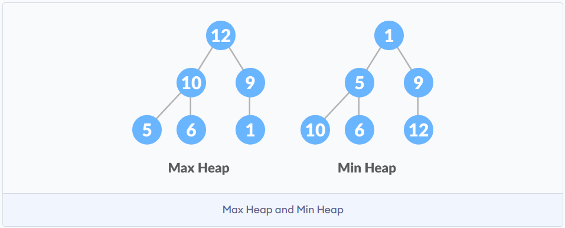

# Sorting
The stability of a sorting algorithm is concerned with how the algorithm treats equal (or repeated) elements. Stable sorting algorithms preserve the relative order of equal elements, while unstable sorting algorithms don't.

- [Bubble Sort](https://www.programiz.com/dsa/bubble-sort) - compares two adjacent elements and swaps them until they are in the intended order. Sorted item will be placed in the end.
- [Selection Sort](https://www.programiz.com/dsa/selection-sort) - finds the smallest element in the unsorted array and swaps it with 1st element of unsorted part.
- [*Insertion Sort](https://www.programiz.com/dsa/insertion-sort) - picks an element and places it in the correct position in the sorted part.
- [*Merge Sort](https://www.programiz.com/dsa/merge-sort) - divides the array into two halves, sorts them and then merges them. The most important part is merge step.
   
- [Quick Sort](https://www.programiz.com/dsa/quick-sort) - divides the array into two parts around a pivot element and then sorts them. Pivot = last element. Pivot + left pointer algorithm.
- [Counting Sort](https://www.programiz.com/dsa/counting-sort) - counts the number of elements in the array and then places them in the correct order.
   
- [Radix Sort](https://www.programiz.com/dsa/radix-sort) - sorts the elements by first grouping the individual digits of the same place value. Then, sort the elements according to their increasing/decreasing order.
   
- [Bucket Sort](https://www.programiz.com/dsa/bucket-sort) - divides the array into buckets (ranges). Each bucket is then sorted individually either using a different sorting algorithm or by recursively applying the bucket sorting algorithm.
   
- [*Heap Sort](https://www.programiz.com/dsa/heap-sort) - uses a heap data structure to sort the elements. Heap is a complete binary tree (nodes placed from left to right).
  - Complete binary tree has this interesting behavior:
    - If the index of any element in the array is `i`, the element in the index `2i+1` will become the left child and element in `2i+2` index will become the right child. 
    - Also, the parent of any element at index `i` is given by the lower bound of `(i-1)/2`
    - First index of a non-leaf node is given by `n/2 - 1`. All other nodes after that are leaf-nodes and thus don't need to be heapified.
   
   

## Complexities
`n` = number of elements in the array.
`k` = MAX num for counting sort. length(MAX) for radix sort. Number of buckets for bucket sort.
 
